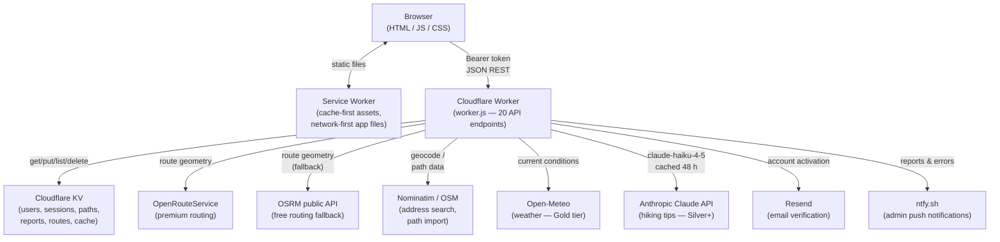

# BWR — Balades en Forêt de Compiègne

Progressive web app for interactive path mapping and route planning in the Compiègne forest, France.

## Architecture



### Three-tier routing fallback

```
1. Graph Router (js/graph-router.js)
   └─ Dijkstra on admin-curated path network — forest-only, guaranteed no-backtrack loops
      ↓ falls back if < 4 nodes or distance unmatchable
2. OpenRouteService  (ORS_KEY env var required)
   └─ round_trip / A→B with full geometry
      ↓ falls back if key missing or API error
3. OSRM  (always available, no key)
   └─ 8-compass-point waypoints for loops; simple A→B otherwise
      (includes roads, not forest-only)
```

### User tiers

| Feature | Free | Silver | Gold |
|---------|------|--------|------|
| Route planning & path browsing | ✓ | ✓ | ✓ |
| Report issues on paths | ✓ | ✓ | ✓ |
| Save & share routes | — | ✓ | ✓ |
| Daily wheel & AI tips | — | ✓ | ✓ |
| Weather widget | — | — | ✓ |

## Quick start

```bash
npm install
npm run dev:worker        # http://localhost:8787
```

Run all tests (143 tests, ~1.4 s):

```bash
npm test
```

## Deployment

```bash
npm run deploy:worker     # requires `wrangler login`
```

One-time KV namespace setup:

```bash
npm run kv:create BWR_KV
```

One-time admin account creation (after first deploy):

```bash
curl -X POST https://<your-worker>.workers.dev/api/setup \
  -H 'Content-Type: application/json' \
  -d '{"password":"yourpassword"}'
```

Requires `ADMIN_NAME` and `ADMIN_EMAIL` Cloudflare env vars to be set first.

## Environment variables

| Variable | Required | Description |
|----------|----------|-------------|
| `ADMIN_NAME` | Yes (setup) | Display name of the admin account |
| `ADMIN_EMAIL` | Yes (setup) | Email of the admin account |
| `ORS_KEY` | No | OpenRouteService API key; OSRM used as fallback |
| `RESEND_API_KEY` | No (prod: yes) | Resend.com key for email verification |
| `RESEND_FROM` | No | Sender address, e.g. `BWR <noreply@yourdomain.com>` |
| `ANTHROPIC_API_KEY` | No | Claude API key for AI hiking tips (Silver/Gold) |

Set these in the Cloudflare Workers dashboard → Settings → Variables.

## Key files

| Path | Role |
|------|------|
| `worker.js` | Main request router — all 20 API endpoints |
| `worker/kv.js` | KV read/write helpers and key schema |
| `worker/auth-utils.js` | Password hashing, session lookup, rate limiting |
| `worker/ai.js` | Claude API integration and weather helpers |
| `js/graph-router.js` | Client-side Dijkstra route planner |
| `js/features.js` | Plan-gating: `can()`, `limitOf()`, `requiredTier()` |
| `js/config.js` | API URL, map center, status colours |
| `sw.js` | Service worker caching strategy |

## Testing

Three test files, run with the Node built-in test runner:

| File | Covers |
|------|--------|
| `tests/graph-router.test.js` | Haversine, graph build, Dijkstra, loop/A→B |
| `tests/features.test.js` | Plan-gating matrix and weekly quota helpers |
| `tests/worker-auth.test.mjs` | Auth endpoints with in-memory KV mock |

**Rule:** run `npm test` before every commit. Add a test when changing plan gating, KV key schema, or auth logic.
